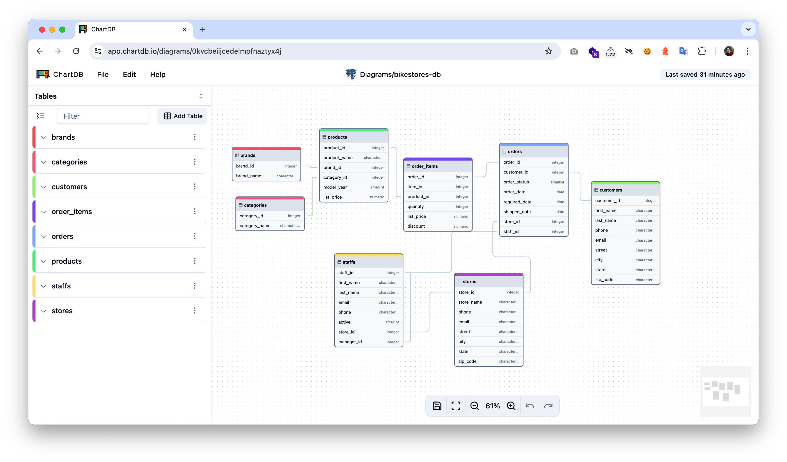

# ViewDB

 

## Introduction

The Laravel ViewDB package provides a seamless integration of [ChartDB](https://github.com/chartdb/chartdb), allowing you to visualize your database schema effortlessly you can instantly generate and view your database diagrams, simplifying database management and enhancing your development workflow.

## Installation

To install the package, run the following command in your Laravel project:

```bash
composer require --dev khufu/viewdb
```

After installation, simply navigate to:

```bash
http://localhost/chartdb
```

All your database tables will be instantly visualized, providing a clear and interactive diagram of your schema. No further setup is required.



## Contributing

If you’d like to contribute to this project, please fork the repository and submit a pull request. Any contributions are welcome!

## Support

For any issues, feature requests, or questions, please open an issue on the [GitHub repository](https://github.com/abdelmoula17/ViewDB).

## Acknowledgements

- [Laravel](https://laravel.com) for the incredible framework.
- [ChartB](https://chartdb.io) for their powerful diagramming tools.

---

Feel free to customize the sections, add installation instructions specific to your package, or provide additional examples as needed!